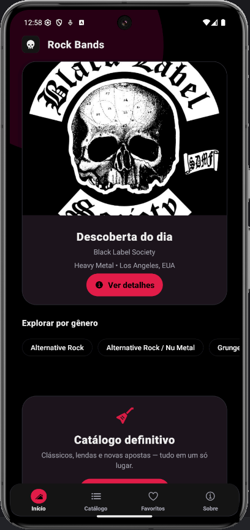
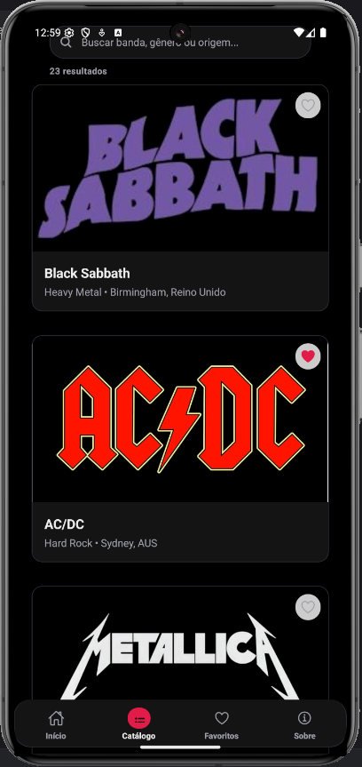
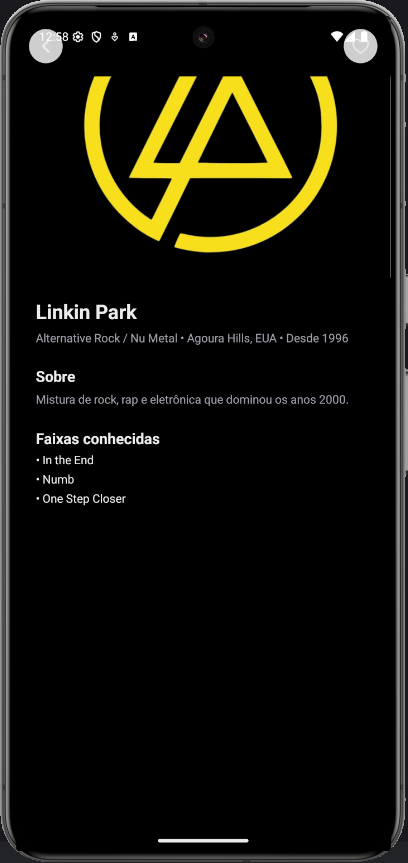

<p align="center">
  
</p>

# 🎸 Rock Bands

Aplicativo mobile desenvolvido durante a disciplina **Aplicações Móveis com React Native**, ministrada pelo **Prof. Esp. Brendo Vale** — UNIVAG.
O **Rock Bands** é um catálogo interativo de bandas de rock e metal, com recursos de descoberta, favoritos e informações detalhadas.

---

## 🚀 Objetivo

Aplicar os principais conceitos de **desenvolvimento mobile com React Native e Expo**, incluindo:

* Estruturação de projeto com **Expo Router**
* Criação de componentes reutilizáveis
* Gerenciamento de estado com **React Hooks**
* Estilização com **StyleSheet** e **Design System**
* Navegação entre telas (Stack e Tabs)
* Persistência de favoritos em contexto global

---

## 🧩 Funcionalidades

* 🎧 **Descoberta do Dia:** banda em destaque exibida aleatoriamente na tela inicial
* 📚 **Catálogo:** listagem de bandas com nome, gênero e país de origem
* ❤️ **Favoritos:** bandas salvas pelo usuário com persistência local
* 🔍 **Exploração por Gênero:** filtros rápidos de categorias musicais
* 📝 **Tela de Detalhes:** exibe informações da banda e faixas conhecidas

---

## 🖼️ Telas Principais

|          Início         |          Catálogo         |          Favoritos         |          Detalhes         |
| :---------------------: | :-----------------------: | :------------------------: | :-----------------------: |
|  |  |  |  |

---

## 🗂️ Estrutura de Pastas

```
ROCK_BANDS-MAIN/
│
├── app/                     # Rotas gerenciadas pelo Expo Router
│   ├── (tabs)/              # Layout de abas (Tabs)
│   │   ├── _layout.tsx
│   │   ├── index.tsx        # Tela inicial (Descoberta)
│   │   ├── catalog.tsx      # Catálogo de bandas
│   │   ├── favorites.tsx    # Favoritos
│   │   ├── about.tsx        # Tela "Sobre"
│   ├── band/                # Stack de detalhes
│   │   ├── [id].tsx         # Detalhes da banda
│   │   ├── _layout.tsx
│   └── assets/              # Ícones e imagens do app
│
├── src/
│   ├── components/          # Componentes reutilizáveis
│   │   ├── BandCard.tsx
│   │   ├── ChipsRow.tsx
│   ├── context/             # Contexto global (favoritos)
│   │   └── favorites.tsx
│   ├── data/                # Dados mockados (bandas)
│   │   └── bands.ts
│   ├── styles/              # Folhas de estilo separadas
│   │   ├── band-card.styles.ts
│   │   ├── catalog.styles.ts
│   │   └── home.styles.ts
│   └── theme/               # Design System centralizado
│       └── theme.ts
│
├── App.tsx                  # Ponto de entrada do Expo
├── app.json                 # Configuração do Expo
├── package.json             # Dependências do projeto
├── tsconfig.json            # Configuração TypeScript
└── README.md
```

---

## ⚙️ Instalação e Execução

```bash
# Clone o repositório
git clone https://github.com/seu-usuario/rock-bands.git

# Acesse a pasta
cd rock-bands

# Instale as dependências
npm install

# Execute o projeto
npx expo start
```

> 💡 Use o **Expo Go** no seu celular ou o **emulador Android Studio** para visualizar o app.

---

## 🛠️ Tecnologias Utilizadas

* **React Native** — Framework principal
* **Expo** — Ambiente de desenvolvimento simplificado
* **Expo Router** — Navegação baseada em estrutura de pastas
* **TypeScript** — Tipagem estática para maior segurança
* **StyleSheet + Flexbox** — Estilização e layout responsivo
* **React Context API** — Gerenciamento de favoritos

---

## 🧠 Aprendizados

* Organização modular de rotas com o **Expo Router**
* Criação de **componentes reutilizáveis e estilizados**
* Aplicação de **tema global (cores, fontes e espaçamento)**
* Uso de **hooks** (`useState`, `useContext`, `useEffect`)
* Integração de **Tabs e Stack Navigator** em um único fluxo

---

## 👩‍💻 Equipe de Desenvolvimento

| Nome           | Função                         |
| -------------- | ------------------------------ |
| [João Gabriel Miler]     | Desenvolvimento Frontend e UI  |
| [Erik Augusto Benevides] | Lógica de Favoritos e Contexto |
| [Gabriel Beretta Padilha] |          |

---

## 🏫 Disciplina

**Aplicações Móveis com React Native**
Prof. Esp. **Brendo Vale** — [brendo@univag.edu.br](mailto:brendo@univag.edu.br)
Centro Universitário de Várzea Grande – **UNIVAG**

---

## ⚠️ Observações

* Aplicativo com fins **educacionais**, sem integração com API real.
* Dados de bandas são estáticos e simulam uma base local.

---
